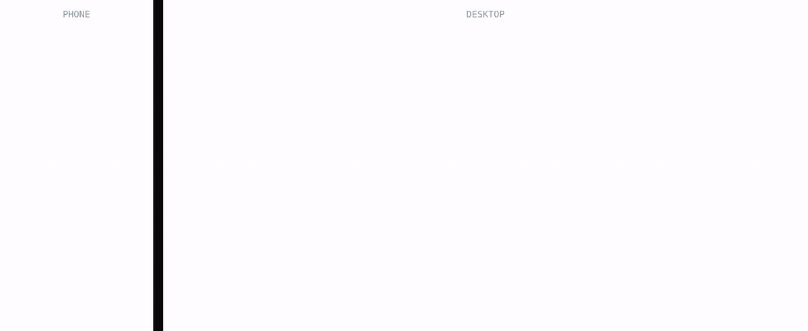

# Shells

Your VPS shells — phone to desktop. End-to-end encrypted, zero-trust web terminal.

Single static binary. No Node.js, no npm, no dependencies. Just Go.

[](LICENSE)
[](https://github.com/socket-cat/shells/releases)

---

## Get started

```bash
curl -fsSL "https://github.com/socket-cat/shells/releases/latest/download/shells-$(uname -s | tr A-Z a-z)-$(uname -m | sed 's/x86_64/amd64/;s/aarch64/arm64/')" -o shells
chmod +x shells
SECRET=your-secret PORT=2222 ./shells
```

<p align="center"></p>

The one-liner above works on **Linux, macOS, and FreeBSD** — it auto-detects your OS and CPU. Open `http://localhost:2222` and enter **`your-secret`** when the browser asks for the E2E secret — it's the `SECRET` you just set. Pick your own for real use; you'll type the same value in the browser to connect.

Prebuilt for **linux / darwin / freebsd × amd64 / arm64**. See [releases](https://github.com/socket-cat/shells/releases/latest) for checksums and direct asset links.

## Why

- **One binary** — 8 MB, fully static, cross-compiled. Drop it on any Linux, macOS, or FreeBSD box.
- **Zero deps** — pure Go standard library. No `node_modules`, no native addons.
- **E2E encrypted** — every keystroke encrypted in the browser before it leaves your device.
- **Mobile-first** — works great on phones. Installable PWA, touch gestures, on-screen keyboard picker.
- **Rootless** — runs as your user, no sudo.

## Run it

`SECRET` is your E2E shared secret — the browser asks for it, and you must enter the **same value** to connect. Pick a strong one and keep it.

```bash
SECRET=your-secret PORT=2222 ./shells
```

For production, put it behind a reverse proxy with TLS (the PWA needs HTTPS); the `SECRET` stays the same.

## Configure

| Variable | Default | What |
|---|---|---|
| `PORT` | `2222` | Listen port |
| `SECRET` | random | E2E shared secret — **set this** |
| `MAX_SESSIONS` | `200` | Max concurrent shells |
| `SHELLS_CWD` | `~` | Default working directory |
| `SHELLS_DEFAULT_SHELL` | auto-detected | Shell binary — found on `PATH` (`bash`, then `sh`, then `zsh`); `/bin/sh` on stock FreeBSD |
| `SHELLS_KEY_DIR` | `~/.socket.cat/config/shells` | Keys + state directory |
| `SHELLS_UPDATE_CHECK` | `true` | Self-update check (opt-out: `false`; users can also uncheck it in the Backend dialog) |

## Build from source

Requires Go 1.24+. Most users don't need this — grab the prebuilt binary above.

```bash
CGO_ENABLED=0 go build -ldflags='-s -w' -o shells .
./shells
```

Cross-compile another target (linux/darwin/freebsd × amd64/arm64):

```bash
CGO_ENABLED=0 GOOS=freebsd GOARCH=amd64 go build -ldflags='-s -w' -o shells-freebsd-amd64 .
```

**Stack**: Go 1.24 stdlib only — `crypto/aes`, `crypto/ecdh`, `crypto/sha256`, `syscall`, `net/http`.
Frontend: vanilla JS + xterm.js, embedded at build time via `//go:embed`.

**Crypto**: P-256 ECDH → HKDF-SHA256 → AES-256-GCM. Native WebCrypto (browser), Go stdlib (server). PBKDF2(600k) for the shared secret.

**Layout**: `main.go` (bootstrap) · `internal/` (14 packages: websocket, pty, crypto, session, wshandler, api, …) · `public/` (frontend).

## License

[AGPL-3.0](LICENSE)

---

*AES-GCM all the way — [socket.cat](https://socket.cat)*
