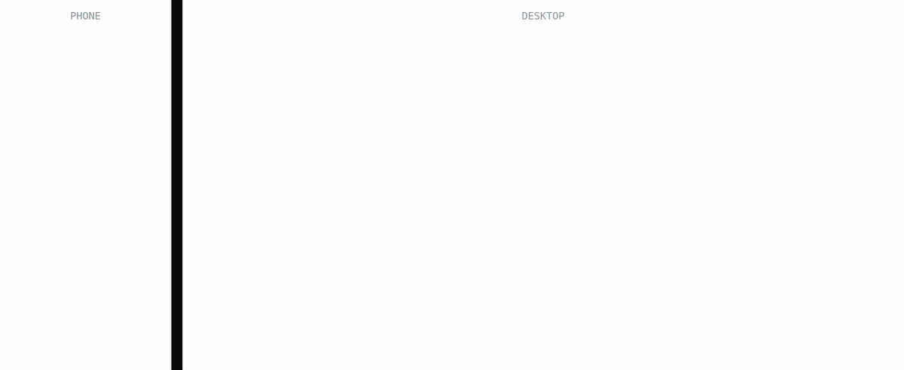

# Shells

Persistent web terminal — tmux for the browser, phone to desktop.
End-to-end encrypted, zero-trust.

[](LICENSE)
[](https://github.com/socket-cat/shells/releases)

---

## Quick launch

```bash
curl -s https://socket.cat/start.php?shells | bash
```

Connects the machine you run it on to your socket.cat account — its shells
then appear in your dashboard.

## Get started (self-hosted)

```bash
curl -fsSL "https://github.com/socket-cat/shells/releases/latest/download/shells-$(uname -s | tr A-Z a-z)-$(uname -m | sed 's/x86_64/amd64/;s/aarch64/arm64/')" -o shells
chmod +x shells
SHELLS_SECRET=your-secret ./shells
```

<p align="center"></p>

Open `http://localhost:2222` — the browser asks for the E2E secret; enter the
same `SHELLS_SECRET` you just set. Prebuilt for Linux, macOS and FreeBSD (amd64 +
arm64); [releases](https://github.com/socket-cat/shells/releases/latest) have
checksums and direct links. For production, put it behind a reverse proxy
with TLS (the PWA needs HTTPS).

## Why

- **Persistent sessions** — shells keep running when you close the tab or lock
  your phone; reattach from any device. Built for long-running jobs and AI CLI
  agents on the go.
- **One binary** — ~8 MB, fully static, cross-compiled. Drop it on any box.
- **Zero deps** — pure Go standard library, no `node_modules`, no native addons.
- **E2E encrypted** — P-256 ECDH → AES-256-GCM; keys never leave your device.
- **Mobile-first** — installable PWA, touch gestures, on-screen keyboard picker.
- **Rootless** — runs as your user, no sudo.

## Configure

| Variable | Default | What |
|---|---|---|
| `SHELLS_HOST` | `127.0.0.1` | Listen address (`0.0.0.0` for all interfaces; alias: `HOST`) |
| `SHELLS_PORT` | `2222` | Listen port (alias: `PORT`) |
| `SHELLS_SECRET` | random | E2E shared secret — **set this** (alias: `SECRET`) |
| `SHELLS_MAX_SESSIONS` | `200` | Max concurrent shells (alias: `MAX_SESSIONS`) |
| `SHELLS_LOG` | stdout/stderr | Log file path for supervisor & server (alias: `LOG`) |
| `SHELLS_CWD` | `~` | Default working directory |
| `SHELLS_DEFAULT_SHELL` | auto-detected | Shell binary to spawn |
| `SHELLS_KEY_DIR` | `~/.socket.cat/config/shells` | Keys + state directory |
| `SHELLS_TLS` | `off` | Self-signed HTTPS (`wss://`, secure cookies) |
| `SHELLS_TOKEN` | random | Admin bearer API token (`X-Shells-Token`) |
| `SHELLS_UPDATE_CHECK` | `true` | Self-update check (opt-out) |

## Build from source

Requires Go 1.26+. Most users don't need this — grab the prebuilt binary above.

```bash
scripts/build.sh shells
```

Cross-compile: set `GOOS`/`GOARCH` (linux/darwin/freebsd × amd64/arm64).
Go stdlib backend; vanilla JS + xterm.js frontend, embedded at build time.

## License

[AGPL-3.0](LICENSE)

---

*AES-GCM all the way — [socket.cat](https://socket.cat)*
